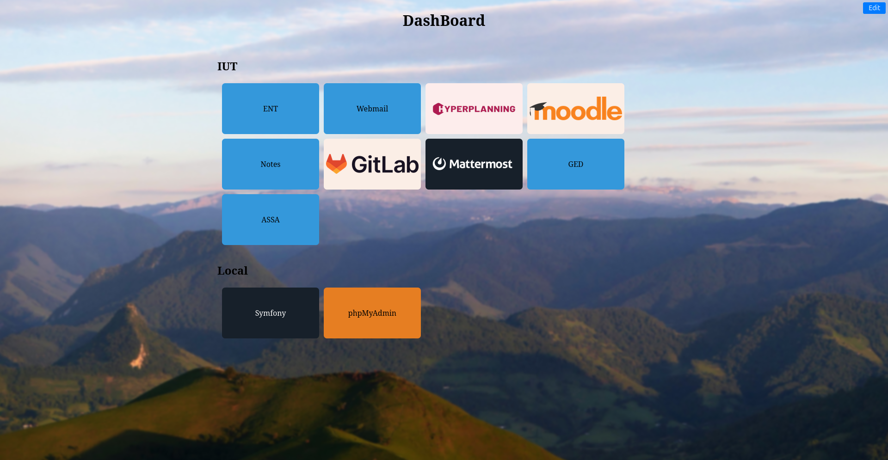

# My Web Dashboard
A simple web application to organise and quickly access your favorite websites.

## Language
**front-end :** JavaScript - VueJs
**back-end :** Python - Flask

## Functionalities
- Create, edit, delete and move sections
- Create, edit, delete and move links
- Change background image

## Set-up
### Linux
- Clone project
  `git clone git@github.com:FofoIsOnInternet/my-web-dashboard.git`
- Launch
  `cd my-web-dashboard`
  `./start`